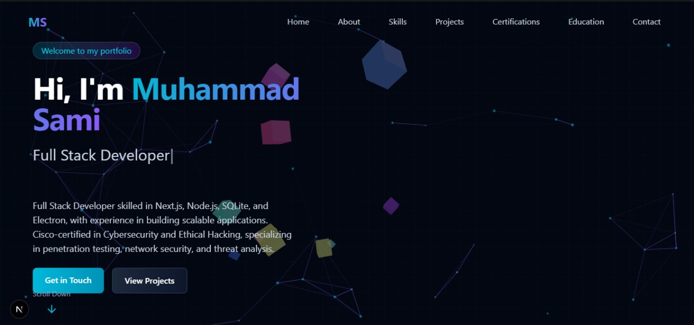

# 🚀 Futuristic Portfolio Website

<div align="center">
  
  
  <br/>
  <br/>
  
  [](https://nextjs.org/)
  [](https://www.typescriptlang.org/)
  [](https://tailwindcss.com/)
  [](https://reactjs.org/)
  [](https://threejs.org/)
  
  📌 A cutting-edge personal portfolio website with futuristic design, immersive animations, and interactive elements
</div>

## ✨ Features

- 🌃 **Futuristic Dark Mode Design**
  - Sleek, cyberpunk-inspired dark interface
  - Glassmorphism effect UI panels with glow effects
  - Gradient text and borders with custom animations

- 🔮 **Advanced Animation System**
  - Interactive particle system background with [tsParticles](https://particles.js.org/)
  - Floating 3D elements with [Three.js](https://threejs.org/) and [@react-three/fiber](https://docs.pmnd.rs/react-three-fiber)
  - Grid pattern with subtle animations for depth perception
  - Smooth scroll animations and transitions with [Framer Motion](https://www.framer.com/motion/)

- 🌟 **Polished UI/UX Components**
  - Dynamic typewriter effect for hero section text
  - Interactive project cards with hover animations
  - Animated skill bars with custom icons
  - Responsive design optimized for all device sizes

- 📱 **Comprehensive Portfolio Sections**
  - Hero section with animated introduction
  - About section with personal details and contact info
  - Skills showcase with proficiency indicators
  - Projects gallery with interactive preview cards
  - Certifications and education timeline
  - Contact form with animated submission

- 🛠️ **Modern Tech Stack**
  - Built with [Next.js 15](https://nextjs.org/) App Router
  - [TypeScript](https://www.typescriptlang.org/) for type safety
  - [Tailwind CSS v4](https://tailwindcss.com/) with custom utilities
  - [React 19](https://react.dev/) with latest features
  - Optimized for performance and SEO

## 🖥️ Demo

🔗 [Live Demo](#) - *Coming soon*

## 🚀 Getting Started

### Prerequisites

- Node.js 18.17.0 or later
- pnpm, npm, or yarn

### Installation

1. Clone this repository:
   ```bash
   git clone https://github.com/yourusername/futuristic-portfolio.git
   cd futuristic-portfolio
   ```

2. Install dependencies:
   ```bash
   npm install
   ```

3. Run the development server:
   ```bash
   npm run dev
   ```
   
   For production build preview:
   ```bash
   npm run dev:prod
   ```

### Building for Production

1. Build the project:
   ```bash
   npm run build
   ```

2. Start the production server:
   ```bash
   npm run start
   ```

## 📂 Project Structure

```
src/
  ├── app/                 # Next.js App Router pages
  ├── components/          # Reusable UI components
  │   ├── background/      # Background animation components
  │   ├── sections/        # Page section components
  │   └── ui/              # Shared UI components
  ├── data/                # Portfolio data and content
  ├── hooks/               # Custom React hooks
  ├── types/               # TypeScript type definitions
  └── utils/               # Utility functions
```

## 💻 Tech Stack

### Frontend Framework
- [Next.js 15](https://nextjs.org/) - React framework with App Router
- [React 19](https://react.dev/) - UI library

### Styling & Design
- [Tailwind CSS 4](https://tailwindcss.com/) - Utility-first CSS framework
- [Framer Motion](https://www.framer.com/motion/) - Animation library

### 3D & Visual Effects
- [Three.js](https://threejs.org/) - 3D library for WebGL
- [React Three Fiber](https://docs.pmnd.rs/react-three-fiber) - React renderer for Three.js
- [tsParticles](https://particles.js.org/) - Particle animation library

### Programming Language
- [TypeScript](https://www.typescriptlang.org/) - Typed JavaScript

## 🎨 Customization

This portfolio is designed to be easily customizable. Most content can be modified through the data file:

```typescript
// Update src/data/portfolioData.ts with your information
```

### Themes and Colors

Main theme colors are defined in `src/app/globals.css`:

```css
:root {
  --primary: #06B6D4;    /* Cyan */
  --secondary: #8B5CF6;  /* Purple */
  --accent: #EC4899;     /* Pink */
  --dark: #0F172A;       /* Dark blue slate */
  --darker: #030712;     /* Nearly black */
}
```

## 📸 Screenshots

<div align="center">
  
  
</div>

## 🔧 Development

```bash
# Run development server with turbopack
npm run dev

# Run development server without turbopack
npm run dev:prod

# Build for production
npm run build

# Start production server
npm run start

# Lint the code
npm run lint
```

## 🌐 Deployment

This portfolio site can be deployed on various platforms:

### Vercel (Recommended)
```bash
# Install Vercel CLI
npm install -g vercel

# Deploy to Vercel
vercel
```

### GitHub Pages
Set up GitHub Actions workflow for automatic deployment.

### Netlify
Connect your GitHub repository to Netlify for continuous deployment.

## 🤝 Contributing

Contributions are welcome! Please feel free to submit a Pull Request.

1. Fork the repository
2. Create your feature branch (`git checkout -b feature/amazing-feature`)
3. Commit your changes (`git commit -m 'Add some amazing feature'`)
4. Push to the branch (`git push origin feature/amazing-feature`)
5. Open a Pull Request

## 📝 License

This project is licensed under the MIT License - see the [LICENSE](LICENSE) file for details.

## 👨‍💻 Author

Your Name - [GitHub](https://github.com/yourusername)

## ⭐ Star This Repository

If you find this portfolio template useful, please consider giving it a star to show your support!

## 📸 Screenshots

<div align="center">
  
  
</div>

## 📄 Resources

- [Next.js Documentation](https://nextjs.org/docs) - learn about Next.js features and API.
- [Learn Next.js](https://nextjs.org/learn) - an interactive Next.js tutorial.

You can check out [the Next.js GitHub repository](https://github.com/vercel/next.js) - your feedback and contributions are welcome!

## Deploy on Vercel

The easiest way to deploy your Next.js app is to use the [Vercel Platform](https://vercel.com/new?utm_medium=default-template&filter=next.js&utm_source=create-next-app&utm_campaign=create-next-app-readme) from the creators of Next.js.

Check out our [Next.js deployment documentation](https://nextjs.org/docs/app/building-your-application/deploying) for more details.
